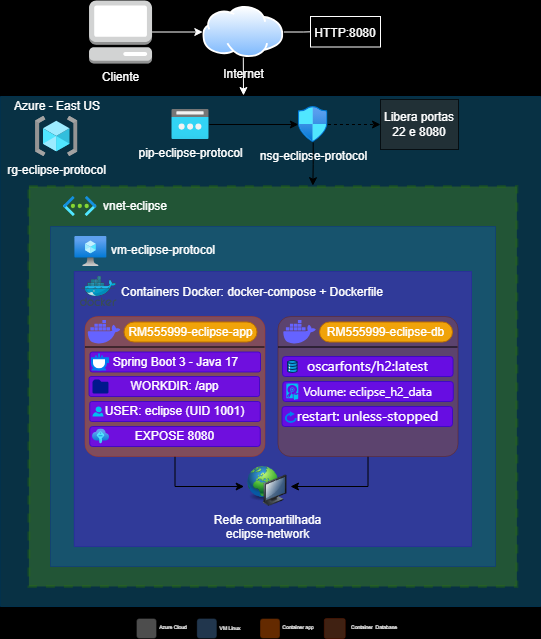

# 🛰️ Eclipse Protocol — IoT Agronegócio

> **FIAP Global Solution 2026** — Plataforma inteligente de monitoramento agrícola via sensores IoT, leituras ambientais e camada espacial com satélites.

---

## 📋 Índice

1. [Descrição do Projeto](#1-descrição-do-projeto)
2. [Benefícios para o Negócio](#2-benefícios-para-o-negócio)
3. [Arquitetura Macro na Nuvem](#3-arquitetura-macro-na-nuvem)
4. [Entidades](#4-entidades)
5. [Endpoints da API](#5-endpoints-da-api)
6. [Instalação — How To](#6-instalação--how-to)
7. [Dockerfile](#7-dockerfile)
8. [Docker Compose](#8-docker-compose)
9. [Script Azure CLI](#9-script-azure-cli)
10. [Vídeo Explicativo](#10-vídeo-explicativo)
11. [Equipe](#11-equipe)

---

## 1. Descrição do Projeto

O **Eclipse Protocol** é uma plataforma de monitoramento inteligente para o agronegócio que centraliza dados de sensores IoT distribuídos em campo, permitindo acompanhamento em tempo real de temperatura, umidade, precipitação e NDVI das plantações.

A solução gera **alertas automáticos** com base nas leituras ambientais, classificados por tipo e severidade, apoiando produtores rurais na tomada de decisão preventiva.

Além da camada agrícola, o projeto conta com uma **camada espacial** que monitora satélites, imagens de satélite, lixo espacial e riscos orbitais.

**Stack:**

| Tecnologia | Versão |
|-----------|--------|
| Java | 17 |
| Spring Boot | 3.x |
| Spring Data JPA | — |
| H2 Database | Modo arquivo |
| SpringDoc OpenAPI | — |
| Docker | 24+ |
| Azure VM | Ubuntu 22.04 |

**Entidades:** Usuario, Localizacao, Propriedade, Plantacao, Sensor, Leitura, Alerta, Satelite, ImagemSatelite, LixoEspacial, RiscoOrbital

---

## 2. Benefícios para o Negócio

| Benefício | Impacto |
|-----------|---------|
| **Alertas automáticos por IoT** | Detecta anomalias (temperatura, NDVI, umidade) antes de virarem perdas |
| **Histórico longitudinal de leituras** | Análise de tendências por talhão e cultura |
| **Gestão multi-propriedade** | Um produtor gerencia várias fazendas e plantações centralizadas |
| **Camada espacial** | Integração futura com Copernicus/Sentinel para NDVI via satélite |
| **API REST documentada** | Integração com apps mobile e dashboards externos via Swagger |
| **Containerização cloud-native** | Deploy em minutos, escalável e reproduzível |

---

## 3. Arquitetura Macro na Nuvem



---

## 4. Entidades

### 🧑 Usuario
| Campo | Tipo | Descrição |
|---|---|---|
| id | Long | Identificador único |
| nome | String | Nome completo |
| email | String | E-mail único |
| senha | String | Senha de acesso |
| ativo | Boolean | Status do usuário |
| dataCriacao | LocalDateTime | Data de criação |

### 📍 Localizacao
| Campo | Tipo | Descrição |
|---|---|---|
| id | Long | Identificador único |
| cidade | String | Cidade |
| estado | String | Estado (UF) |
| pais | String | País |
| coordenadas | **@Embedded** `Coordenadas` | Objeto embutido com latitude e longitude |
| coordenadas.latitude | Double | Latitude geográfica |
| coordenadas.longitude | Double | Longitude geográfica |
| cep | String | CEP |

> `Coordenadas` é uma classe `@Embeddable` dentro de `Localizacao`. Os campos `latitude` e `longitude` são persistidos diretamente nas colunas `NR_LATITUDE` e `NR_LONGITUDE` via `@AttributeOverride`.

### 🏡 Propriedade
| Campo | Tipo | Descrição |
|---|---|---|
| id | Long | Identificador único |
| nome | String | Nome da propriedade |
| areaTotal | Double | Área total (ha) |
| tipoSolo | String | Tipo do solo |
| localizacao | Localizacao | FK localização |
| usuario | Usuario | FK proprietário |

### 🌱 Plantacao
| Campo | Tipo | Descrição |
|---|---|---|
| id | Long | Identificador único |
| nome | String | Nome da plantação |
| cultura | String | Tipo de cultura |
| areaHectares | Double | Área em hectares |
| status | String | Status atual |
| propriedade | Propriedade | FK propriedade |

### 📡 Sensor
| Campo | Tipo | Descrição |
|---|---|---|
| id | Long | Identificador único |
| nome | String | Nome do sensor |
| tipo | String | Tipo do sensor |
| ativo | Boolean | Status do sensor |
| plantacao | Plantacao | FK plantação |

> `Sensor` usa `@Inheritance(SINGLE_TABLE)`. O subtipo `SensorEspecializado` estende `Sensor` adicionando o campo `unidadeMedida`. O discriminador é a coluna `DS_SUBTIPO`.

### 📊 Leitura
| Campo | Tipo | Descrição |
|---|---|---|
| id | Long | Identificador único |
| temperatura | Double | Temperatura (°C) |
| umidade | Double | Umidade (%) |
| precipitacao | Double | Precipitação (mm) |
| ndvi | Double | Índice NDVI |
| dataLeitura | LocalDateTime | Data/hora da leitura |
| sensor | Sensor | FK sensor |

### 🚨 Alerta
| Campo | Tipo | Descrição |
|---|---|---|
| id | Long | Identificador único |
| tipoAlerta | Enum | Tipo do alerta |
| severidade | Enum | Nível de severidade |
| mensagem | String | Descrição do alerta |
| status | Enum | Status do alerta |
| dataCriacao | LocalDateTime | Data/hora de criação |
| leitura | Leitura | FK leitura |
| plantacao | Plantacao | FK plantação |

#### Enums do Alerta
| Enum | Valores |
|---|---|
| TipoAlerta | `TEMP_ALTA`, `TEMP_BAIXA`, `UMID_ALTA`, `UMID_BAIXA`, `NDVI_CRITICO`, `PRECIPITACAO_EXCESSIVA` |
| Severidade | `BAIXA`, `MEDIA`, `ALTA`, `CRITICA` |
| StatusAlerta | `ABERTO`, `RECONHECIDO`, `RESOLVIDO` |

---

### 🛰️ Satelite *(Camada Espacial)*
| Campo | Tipo | Descrição |
|---|---|---|
| id | Long | Identificador único |
| nome | String | Nome do satélite |
| tipo | String | Tipo do satélite |
| orbita | String | Tipo de órbita |
| altitudeKm | Double | Altitude em km |
| status | Enum | Status operacional |
| dataLancamento | LocalDate | Data de lançamento |

#### Enum StatusSatelite
| Valor | Descrição |
|---|---|
| `ATIVO` | Satélite em operação |
| `INATIVO` | Satélite fora de operação |
| `DESCOMISSIONADO` | Satélite desativado permanentemente |

---

### 🖼️ ImagemSatelite *(Camada Espacial)*
| Campo | Tipo | Descrição |
|---|---|---|
| id | Long | Identificador único |
| satelite | Satelite | FK satélite (N:1) |
| plantacao | Plantacao | FK plantação (N:1) |
| urlImagem | String | URL da imagem capturada |
| ndvi | Double | Índice NDVI da imagem |
| coberturaNuvem | Double | % de cobertura de nuvens |
| dataCaptura | LocalDateTime | Data/hora da captura |

---

### 🗑️ LixoEspacial *(Camada Espacial)*
| Campo | Tipo | Descrição |
|---|---|---|
| id | Long | Identificador único |
| nomeObjeto | String | Nome/identificação do objeto |
| tipoObjeto | String | Tipo do objeto |
| altitudeKm | Double | Altitude em km |
| velocidadeKmh | Double | Velocidade em km/h |
| orbita | String | Órbita do objeto |
| dataIdentificacao | LocalDate | Data de identificação |

---

### ⚠️ RiscoOrbital *(Camada Espacial)*
| Campo | Tipo | Descrição |
|---|---|---|
| idSatelite + idLixoEspacial | **Chave composta** (`@EmbeddedId`) | Par único que identifica o risco |
| satelite | Satelite | FK satélite (N:1) — parte da chave |
| lixoEspacial | LixoEspacial | FK lixo espacial (N:1) — parte da chave |
| nivelRisco | Enum | Nível de risco identificado |
| descricaoRisco | String | Descrição detalhada do risco |
| dataAnalise | LocalDateTime | Data/hora da análise |

> A chave primária é composta por `(idSatelite, idLixoEspacial)`. Só pode existir **um registro de risco por par satélite/debris**.

#### Enum NivelRisco
| Valor | Descrição |
|---|---|
| `BAIXO` | Risco baixo |
| `MODERADO` | Risco moderado |
| `ALTO` | Risco alto |
| `CRITICO` | Risco crítico |


### 🔎 Utilitários
| URL | Descrição |
|-----|-----------|
| `http://<HOST>:8080/swagger-ui.html` | Documentação interativa |
| `http://<HOST>:8080/h2-console` | H2 Console Web |

**H2 Console:** URL: `jdbc:h2:file:/app/data/eclipsedb` · User: `sa` · Senha: *(vazio)*

---

## 5. Endpoints da API

### Autenticação
| Método | Endpoint | Descrição | Auth |
|---|---|---|--|
| POST | `/auth/login` | Realiza login e retorna token JWT | ✅ |

### Usuários
| Método | Endpoint | Descrição | Auth |
|---|---|---|--|
| GET | `/usuarios` | Lista todos os usuários | ✅ |
| GET | `/usuarios/{id}` | Busca usuário por ID | ✅ |
| POST | `/usuarios` | Cria novo usuário | ✅ |
| PUT | `/usuarios/{id}` | Atualiza usuário | ✅ |
| DELETE | `/usuarios/{id}` | Remove usuário | ✅ |

### Localizações
| Método | Endpoint | Descrição | Auth |
|---|---|---|---|
| GET | `/localizacoes` | Lista todas as localizações | ✅ |
| GET | `/localizacoes/{id}` | Busca localização por ID | ✅ |
| POST | `/localizacoes` | Cria nova localização | ✅ |
| PUT | `/localizacoes/{id}` | Atualiza localização | ✅ |
| DELETE | `/localizacoes/{id}` | Remove localização | ✅ |

### Propriedades
| Método | Endpoint | Descrição | Auth |
|---|---|---|---|
| GET | `/propriedades` | Lista todas as propriedades | ✅ |
| GET | `/propriedades/{id}` | Busca propriedade por ID | ✅ |
| POST | `/propriedades` | Cria nova propriedade | ✅ |
| PUT | `/propriedades/{id}` | Atualiza propriedade | ✅ |
| DELETE | `/propriedades/{id}` | Remove propriedade | ✅ |

### Plantações
| Método | Endpoint | Descrição | Auth |
|---|---|---|---|
| GET | `/plantacoes` | Lista todas as plantações | ✅ |
| GET | `/plantacoes/{id}` | Busca plantação por ID | ✅ |
| POST | `/plantacoes` | Cria nova plantação | ✅ |
| PUT | `/plantacoes/{id}` | Atualiza plantação | ✅ |
| DELETE | `/plantacoes/{id}` | Remove plantação | ✅ |

### Sensores
| Método | Endpoint | Descrição | Auth |
|---|---|---|---|
| GET | `/sensores` | Lista todos os sensores | ✅ |
| GET | `/sensores/{id}` | Busca sensor por ID | ✅ |
| POST | `/sensores` | Cria novo sensor | ✅ |
| PUT | `/sensores/{id}` | Atualiza sensor | ✅ |
| DELETE | `/sensores/{id}` | Remove sensor | ✅ |

### Leituras
| Método | Endpoint | Descrição | Auth |
|---|---|---|---|
| GET | `/leituras` | Lista todas as leituras | ✅ |
| GET | `/leituras/{id}` | Busca leitura por ID | ✅ |
| POST | `/leituras` | Registra nova leitura | ✅ |
| PUT | `/leituras/{id}` | Atualiza leitura | ✅ |
| DELETE | `/leituras/{id}` | Remove leitura | ✅ |

### Alertas
| Método | Endpoint | Descrição | Auth |
|---|---|---|---|
| GET | `/alertas` | Lista todos os alertas | ✅ |
| GET | `/alertas/{id}` | Busca alerta por ID | ✅ |
| POST | `/alertas` | Cria novo alerta | ✅ |
| PUT | `/alertas/{id}` | Atualiza alerta | ✅ |
| DELETE | `/alertas/{id}` | Remove alerta | ✅ |

### Satélites *(Camada Espacial)*
| Método | Endpoint | Descrição | Auth |
|---|---|---|---|
| GET | `/satelites` | Lista todos os satélites | ✅ |
| GET | `/satelites/{id}` | Busca satélite por ID | ✅ |
| POST | `/satelites` | Cadastra novo satélite | ✅ |
| PUT | `/satelites/{id}` | Atualiza satélite | ✅ |
| DELETE | `/satelites/{id}` | Remove satélite | ✅ |

### Imagens de Satélite *(Camada Espacial)*
| Método | Endpoint | Descrição | Auth |
|---|---|---|---|
| GET | `/imagens-satelite` | Lista todas as imagens | ✅ |
| GET | `/imagens-satelite/{id}` | Busca imagem por ID | ✅ |
| POST | `/imagens-satelite` | Registra nova imagem | ✅ |
| PUT | `/imagens-satelite/{id}` | Atualiza imagem | ✅ |
| DELETE | `/imagens-satelite/{id}` | Remove imagem | ✅ |

### Lixo Espacial *(Camada Espacial)*
| Método | Endpoint | Descrição | Auth |
|---|---|---|---|
| GET | `/lixo-espacial` | Lista todos os objetos | ✅ |
| GET | `/lixo-espacial/{id}` | Busca objeto por ID | ✅ |
| POST | `/lixo-espacial` | Registra novo objeto | ✅ |
| PUT | `/lixo-espacial/{id}` | Atualiza objeto | ✅ |
| DELETE | `/lixo-espacial/{id}` | Remove objeto | ✅ |

### Riscos Orbitais *(Camada Espacial)*
| Método | Endpoint | Descrição | Auth |
|---|---|---|---|
| GET | `/riscos-orbitais` | Lista todos os riscos | ✅ |
| GET | `/riscos-orbitais/{idSatelite}/{idLixoEspacial}` | Busca risco pela chave composta | ✅ |
| POST | `/riscos-orbitais` | Registra novo risco | ✅ |
| PUT | `/riscos-orbitais/{idSatelite}/{idLixoEspacial}` | Atualiza risco | ✅ |
| DELETE | `/riscos-orbitais/{idSatelite}/{idLixoEspacial}` | Remove risco | ✅ |

---

## 6. Instalação — How To

### Pré-requisitos
- Docker 24+ e Docker Compose Plugin
- Git
- Azure CLI *(apenas para deploy em nuvem)*

### ▶️ Rodar localmente

```bash
# 1. Clonar o repositório
git clone https://github.com/GlobalSolution-FIAP2026/eclipse-protocol-cloud.git
cd eclipse-protocol-cloud

# 2. Subir os 2 containers em background
docker compose up -d --build

# 3. Verificar containers
docker compose ps

# 4. Ver logs
docker compose logs -f eclipse-app
docker compose logs -f eclipse-db

# 5. Acessar H2 Console
# http://localhost:8080/h2-console
# JDBC URL: jdbc:h2:file:/app/data/eclipsedb

# 6. Acessar Swagger
# http://localhost:8080/swagger-ui.html

# 7. Verificar usuário dos containers
docker container exec RM555999-eclipse-app whoami   # eclipse
docker container exec RM555999-eclipse-app pwd       # /app
docker container exec RM555999-eclipse-app ls -l /app

# 8. Derrubar (sem apagar dados)
docker compose down
# Para apagar dados também:
docker compose down -v
```

### ☁️ Deploy na Azure

```bash
# 1. Login
az login

# 2. Provisionar VM
chmod +x azure-setup.sh && ./azure-setup.sh

# 3. Conectar na VM
ssh eclipseadmin@<VM_IP>

# 4. Clonar e subir
cd /opt/eclipse-protocol
git clone https://github.com/GlobalSolution-FIAP2026/eclipse-protocol-cloud.git .
docker compose up -d --build

# 5. AO FINALIZAR — deletar VM
exit
./azure-delete.sh
```

---

## 7. Dockerfile

```dockerfile
FROM maven:3.9-eclipse-temurin-17-alpine
RUN addgroup -S eclipse && adduser -S eclipse -G eclipse -u 1001
WORKDIR /app
ENV APP_NAME="eclipse-protocol" APP_ENV="prod" APP_PORT=8080
COPY pom.xml ./
RUN mvn dependency:go-offline -q
COPY src ./src
RUN mvn package -DskipTests -q
RUN mkdir -p /app/data && chown -R eclipse:eclipse /app
RUN cp target/*.jar app.jar && chown eclipse:eclipse app.jar
USER eclipse
EXPOSE 8080
ENTRYPOINT ["java", \
  "-Djava.security.egd=file:/dev/./urandom", \
  "-Dspring.profiles.active=prod", \
  "-Dspring.datasource.url=jdbc:h2:file:/app/data/eclipsedb;AUTO_SERVER=TRUE", \
  "-jar", "app.jar"]
```

---

## 8. Docker Compose

```yaml
services:
  eclipse-db:
    image: oscarfonts/h2:latest
    container_name: RM555999-eclipse-db
    restart: unless-stopped
    environment:
      H2_OPTIONS: "-tcp -tcpAllowOthers -tcpPort 9092 -web -webAllowOthers -webPort 8082"
    ports:
      - "9092:9092"
      - "8082:8082"
    volumes:
      - eclipse_h2_data:/opt/h2-data
    networks:
      - eclipse-network

  eclipse-app:
    build: .
    container_name: RM555999-eclipse-app
    restart: unless-stopped
    depends_on: [eclipse-db]
    environment:
      SPRING_PROFILES_ACTIVE: prod
      SPRING_DATASOURCE_URL: jdbc:h2:file:/app/data/eclipsedb;AUTO_SERVER=TRUE
    ports:
      - "8080:8080"
    volumes:
      - eclipse_h2_data:/app/data
    networks:
      - eclipse-network
    user: "1001"

networks:
  eclipse-network:
    name: eclipse-network

volumes:
  eclipse_h2_data:
    name: eclipse_h2_data
```

---

## 9. Script Azure CLI

O script `azure-setup.sh` executa em sequência:
1. Resource Group `rg-eclipse-protocol` em `eastus`
2. VM Ubuntu 22.04 LTS — `Standard_B2s`
3. NSG com portas: 22, 8080
4. Docker Engine, Docker Compose Plugin, Git e ferramentas

Para remover ao final:
```bash
./azure-delete.sh
```

---

## 10. Vídeo explicativo

[](https://youtu.be/JpHNS4_ZvZY)

---

## 11. Equipe

| Nome | RM |
|------|----|
| Gustavo Gomes Martins | 555999 |
| Pedro dos Anjos | 563832 |
| Matheus de Mattos Vecchi | 561716 |
| Nicholas Albuquerque Buzo | 561082 |
| Nicholas Camillo Canadas de Paula | 561262 |

---

> **FIAP** — Global Solution 2026  
> Disciplina: DevOps Tools & Cloud Computing  
> Repositório: [github.com/GlobalSolution-FIAP2026/eclipse-protocol-cloud](https://github.com/GlobalSolution-FIAP2026/eclipse-protocol-cloud)
